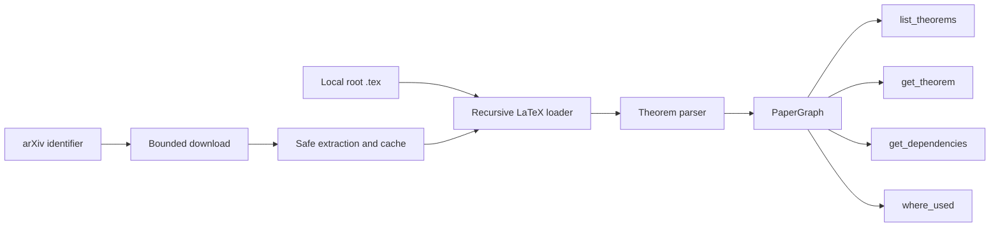

# PaperGraph MCP

[](https://github.com/lotchuazzz-crypto/papergraph-mcp/actions/workflows/ci.yml)
[](https://www.python.org/)
[](LICENSE)
[](https://github.com/lotchuazzz-crypto/papergraph-mcp/releases)

PaperGraph turns local or arXiv LaTeX papers into theorem dependency graphs that AI agents can query through MCP.

## Why PaperGraph?

AI agents often receive a mathematical paper as one flat block of text.
PaperGraph identifies theorem-like environments, keeps their labels and
references, and exposes the resulting graph through small MCP tools. An agent
can ask for one theorem, follow its dependencies, or find every result that
uses it without repeatedly scanning the entire paper.

## Features

- Load local single-file or multi-file LaTeX projects.
- Recursively expand standard `\input` and `\include` commands.
- Download and cache source projects directly from an arXiv identifier.
- Safely unpack common arXiv source formats without following archive links.
- Query theorem text, direct or recursive dependencies, and reverse usage.
- Preserve the active graph when a new project fails to load.

## Quick Start

Install [uv](https://docs.astral.sh/uv/getting-started/installation/), then
verify the GitHub release without cloning the repository:

```powershell
uvx --from git+https://github.com/lotchuazzz-crypto/papergraph-mcp.git@v0.3.1 papergraph-mcp --version
```

The pinned command becomes available after the `v0.3.1` GitHub Release and
tag are published. Pinning the tag keeps MCP client installations reproducible.

## MCP Configuration

For an MCP client that accepts JSON-style stdio server configuration, add:

```json
{
  "mcpServers": {
    "papergraph": {
      "command": "uvx",
      "args": [
        "--from",
        "git+https://github.com/lotchuazzz-crypto/papergraph-mcp.git@v0.3.1",
        "papergraph-mcp"
      ]
    }
  }
}
```

Restart the MCP client after changing its configuration. The server uses
stdio, so running the command without `--help` or `--version` waits quietly
for an MCP client connection.

## Tools

| Tool | Purpose |
| --- | --- |
| `load_paper` | Load a local root `.tex` file and recursively expand its project. |
| `load_arxiv_paper` | Download, safely cache, and load an arXiv source project. |
| `list_theorems` | List theorem-like nodes, optionally filtered by environment kind. |
| `get_theorem` | Return the full text and metadata for one labeled node. |
| `get_dependencies` | Follow direct or recursive references from one node. |
| `where_used` | Find nodes that reference a given theorem-like node. |

## Demo

Ask the MCP client to call:

```text
load_arxiv_paper(arxiv_id="math/0307200")
```

With v0.3.1, PaperGraph automatically selects `main.tex` and parses seven
theorem-like nodes. A shortened representative response is:

```json
{
  "arxiv_id": "math/0307200",
  "path": "main.tex",
  "cached": false,
  "nodes": 7,
  "kinds": {
    "thm": 7
  }
}
```

The exact kind names reflect the LaTeX environment names declared by the
paper. A second call reuses the validated local cache unless `refresh=true`.

## Architecture



## Safety and Cache

PaperGraph only constructs downloads from arXiv's fixed e-print endpoint.
Arbitrary URLs are not accepted. It limits compressed responses to **100 MiB**,
expanded content to **500 MiB**, and archives to **10,000** members. Absolute
paths, parent traversal, symbolic links, hard links, devices, FIFOs, and other
special members are rejected.

Sources are stored in the platform user cache. Cache entries are validated
before reuse, and refreshes are prepared separately so a failed refresh does
not replace a valid project. If root-file selection is ambiguous, retry
`load_arxiv_paper` with a project-relative `main_file` value.

## Development

Clone the repository and run:

```powershell
uv sync
uv run pytest -q -p no:cacheprovider
```

The automated suite uses synthetic archives and `httpx.MockTransport`; it does
not depend on the live arXiv service.

## Contributing

Bug reports, focused features, and compatibility fixtures are welcome. Read
[Contributing](CONTRIBUTING.md) before opening a pull request. Never upload a
private manuscript, credential, token, or unsanitized log.

## Limitations

- There is no PDF fallback; PaperGraph requires LaTeX source.
- Arbitrary URLs are not accepted; remote imports use arXiv identifiers only.
- Unusual project layouts may require an explicit `main_file`.
- The parser focuses on theorem-like environments and `\ref` relationships;
  it is not a complete TeX engine or proof verifier.

## License

PaperGraph is available under the [MIT License](LICENSE).
