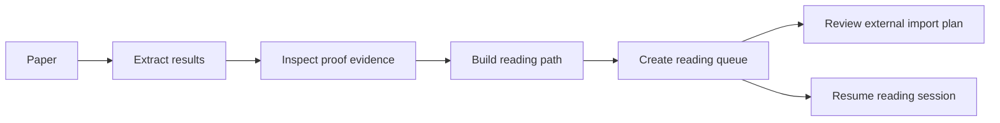

<div align="center">

# PaperGraph MCP

[](https://github.com/lotchuazzz-crypto/papergraph-mcp/actions/workflows/ci.yml)
[](https://www.python.org/)
[](LICENSE)
[](https://github.com/lotchuazzz-crypto/papergraph-mcp/releases)

**Read math papers with evidence, not guesses.**

PaperGraph helps AI agents turn arXiv papers, local LaTeX projects, and born-digital PDFs into a theorem-centered reading workspace. It extracts Paper Maps, results, proof evidence, citation stops, source slices, reading queues, reading sessions, and reviewable import plans so a researcher can inspect where every claim came from.

[English](#english) | [中文](#中文)

</div>

---

## English

### What PaperGraph Helps You Do

| Start with a Paper Map | Trace proof evidence | Plan the next reading step |
| --- | --- | --- |
| Identify main-result candidates, result structure, proof-path evidence, and external reading risks before choosing where to read. | Inspect proof-local references, cited stops, source slices, and dependency diagnostics with explicit evidence. | Build reading queues, resume reading sessions, and review external arXiv import candidates before downloading anything. |

PaperGraph v0.11.0 adds Reading Report Export: a deterministic Markdown report that saves a paper's Paper Map, main-result candidates, recommended reading route, external reading risks, and evidence boundaries outside the MCP window.

### Why Researchers Use It

| Need | How PaperGraph behaves |
| --- | --- |
| "Do not invent dependencies." | PaperGraph reports evidence-backed links and explains empty results as extraction limits, not mathematical facts. |
| "Show me the exact source." | Results, proofs, dependencies, and citations carry source spans that can be sliced back out of the original paper. |
| "Let me review external papers first." | External references become import plans. The agent should ask before importing the next cited paper. |
| "Keep my reading state." | Workspaces store queues, sessions, checkpoints, notes, blocked targets, and open questions locally. |

PaperGraph does not verify proofs, perform semantic theorem matching, or claim that similarly worded results are equivalent.

### Quick Start

Install [uv](https://docs.astral.sh/uv/getting-started/installation/), then verify the pinned GitHub release without cloning:

```powershell
uvx --from git+https://github.com/lotchuazzz-crypto/papergraph-mcp.git@v0.11.0 papergraph-mcp --version
papergraph-mcp doctor
```

The pinned command becomes available after the `v0.11.0` GitHub Release and tag are published. Pinning the tag keeps MCP client installations reproducible.

Add PaperGraph to an MCP client that accepts JSON-style stdio configuration:

```json
{
  "mcpServers": {
    "papergraph": {
      "command": "uvx",
      "args": ["--from", "git+https://github.com/lotchuazzz-crypto/papergraph-mcp.git@v0.11.0", "papergraph-mcp"]
    }
  }
}
```

Restart the MCP client after changing its configuration. The server uses stdio, so running the command without `--help` or `--version` waits quietly for an MCP client connection.

### Ask your agent to set it up

Give a coding agent this request:

> Clone https://github.com/lotchuazzz-crypto/papergraph-mcp and help me set up PaperGraph for my MCP client. Read the repository's onboarding instructions after cloning.

Compatible agents can follow the repository-local [`setting-up-papergraph`](.agents/skills/setting-up-papergraph/SKILL.md) skill. The agent should show you a reusable PaperGraph prompt, explain why `uv` is needed, and ask before installing software, changing client configuration, or restarting the client.

If your agent clones into a directory that already exists, ask it to run `git fetch --tags origin` before treating the checkout as current. Existing clones can otherwise remain pinned to an old local `origin/main`.

For raw user requests, prefer `load_arxiv_request(input=...)` or `papergraph-mcp load-arxiv-request "..."`. These high-level entry points validate bare IDs, URLs, Markdown links, and prose before loading. To inspect the decision without loading, call `validate_arxiv_request` or `papergraph-mcp validate-arxiv-request "..."`. If validation returns `action: ask_user_to_choose`, ask the user to choose; detecting a conflict and then continuing is a failure. Use `load_arxiv_paper` only after the user has provided one already-disambiguated arXiv ID.

### A Typical Reading Flow



1. Load a paper from arXiv, local LaTeX, or PDF.
2. List theorem-like results and choose a target theorem.
3. Inspect the theorem statement, proof evidence, source slice, and dependency diagnostics.
4. Generate a reading queue from local proof evidence.
5. Review external import candidates instead of letting the agent download cited papers automatically.
6. Save checkpoints and notes so the next reading session starts from known state.

### What PaperGraph Does Not Do

| It does | It does not |
| --- | --- |
| Extract and store evidence from papers. | Prove the paper is correct. |
| Follow explicit labels, proof-local references, and citation evidence. | Guess hidden mathematical prerequisites. |
| Build reviewable reading queues and import plans. | Automatically crawl the literature. |
| Keep local reading state in SQLite. | Upload private manuscripts or PDFs. |

## 中文

### PaperGraph 能帮你做什么

| 先看 Paper Map | 追踪证明证据 | 规划下一步阅读 |
| --- | --- | --- |
| 在选择阅读目标前，先看到 main-result candidates、结果结构、proof-path evidence 和 external reading risks。 | 查看 proof-local references、citation stops、source slices 和 dependency diagnostics，并保留证据来源。 | 生成 reading queues、恢复 reading sessions，并在下载外部论文前生成可审阅的导入计划。 |

v0.11.0 的重点是 Reading Report Export：把一篇论文的 Paper Map、main-result candidates、推荐阅读路线、外部阅读风险和证据边界导出成确定性的 Markdown 报告，不再局限于窗口输出。

### 为什么适合数学论文阅读

| 研究者关心的问题 | PaperGraph 的回答 |
| --- | --- |
| 不要猜依赖。 | 只报告有证据的链接；空依赖结果解释为抽取限制，而不是数学事实。 |
| 我要看到原文位置。 | result、proof、dependency、citation 都尽量保留 source span，可回到原文片段。 |
| 外部论文先让我审。 | 外部引用先变成 import plan，agent 不应自动下载。 |
| 阅读项目要能继续。 | workspace 在本地保存 queue、session、checkpoint、note、blocked target 和 open question。 |

PaperGraph does not verify proofs，也不做 semantic theorem matching；它不会声称两个措辞相似的结果数学上等价。

### 快速开始

先安装 [uv](https://docs.astral.sh/uv/getting-started/installation/)，然后验证固定版本：

```powershell
uvx --from git+https://github.com/lotchuazzz-crypto/papergraph-mcp.git@v0.11.0 papergraph-mcp --version
papergraph-mcp doctor
```

如果你的 MCP client 使用 JSON 风格的 stdio server 配置，可以添加：

```json
{
  "mcpServers": {
    "papergraph": {
      "command": "uvx",
      "args": ["--from", "git+https://github.com/lotchuazzz-crypto/papergraph-mcp.git@v0.11.0", "papergraph-mcp"]
    }
  }
}
```

修改配置后重启 MCP client。这个 server 使用 stdio，所以不带 `--help` 或 `--version` 直接运行时，会安静等待 MCP client 连接。

### 让 agent 帮你设置

你可以把这段话发给 coding agent：

> Clone https://github.com/lotchuazzz-crypto/papergraph-mcp and help me set up PaperGraph for my MCP client. Read the repository's onboarding instructions after cloning.

支持本仓库 skill 的 agent 会读取 [`setting-up-papergraph`](.agents/skills/setting-up-papergraph/SKILL.md)，展示可复用提示词，解释为什么需要 `uv`，并在安装软件、修改客户端配置或重启客户端前询问你。

如果目标目录已经存在，请让 agent 先运行 `git fetch --tags origin`，再判断仓库是否是最新。否则已有 clone 可能仍停留在旧的本地 `origin/main`。

普通用户请求优先走 `load_arxiv_request(input=...)` 或 `papergraph-mcp load-arxiv-request "..."`。这些入口会在加载前验证 bare IDs、URLs、Markdown links 和自然语言描述。若验证返回 `action: ask_user_to_choose`，必须让用户选择；detecting a conflict and then continuing is a failure。Use `load_arxiv_paper` only after 用户已经给出单一、无歧义的 arXiv ID。

### 典型阅读流程

1. 从 arXiv、本地 LaTeX 或 PDF 加载论文。
2. 列出 theorem-like results，选择目标定理。
3. 查看 theorem statement、proof evidence、source slice 和 dependency diagnostics。
4. 根据本地 proof evidence 生成 reading queue。
5. 先审阅 external import candidates，再决定是否导入外部论文。
6. 保存 checkpoints 和 notes，下次继续读时不必从头开始。

## Reference

<details>
<summary><strong>Complete Tool Reference</strong></summary>

### Core Workflows

| Workflow | Main tools |
| --- | --- |
| Load papers | `open_workspace`, `workspace_add_local_paper`, `workspace_add_arxiv_paper`, `workspace_add_pdf_paper`, `workspace_list_papers`, `workspace_get_paper` |
| Map a paper | `workspace_get_paper_map`, `workspace_export_paper_reading_report` |
| Inspect results | `workspace_list_results`, `workspace_get_result`, `workspace_get_result_proof`, `workspace_get_proof_dependencies`, `workspace_get_external_result_mentions`, `workspace_get_evidence`, `workspace_get_citations`, `workspace_search_theorems` |
| Read a proof | `workspace_export_reading_bundle`, `workspace_export_result_reading_context`, `workspace_get_source_slice`, `workspace_get_result_reading_path` |
| Resume reading | `workspace_create_reading_session`, `workspace_list_reading_sessions`, `workspace_get_reading_session`, `workspace_record_reading_checkpoint`, `workspace_add_reading_note`, `workspace_export_reading_session_summary` |
| Plan reading | `workspace_create_reading_queue`, `workspace_list_reading_queues`, `workspace_get_reading_queue`, `workspace_apply_reading_queue_to_session` |
| Plan imports | `workspace_plan_external_imports_for_result`, `workspace_plan_external_imports_for_queue`, `workspace_plan_external_imports_for_paper` |

Original single-paper tools: `get_environment_diagnostics`, `validate_arxiv_request`, `load_arxiv_request`, `validate_arxiv_input`, `load_paper`, `load_arxiv_paper`, `list_theorems`, `get_theorem`, `get_dependencies`, `get_dependency_diagnostics`, and `where_used`.

Complete workspace tool index: `open_workspace`, `workspace_add_local_paper`, `workspace_add_arxiv_paper`, `workspace_list_papers`, `workspace_get_paper`, `workspace_search_theorems`, `workspace_get_dependencies`, `workspace_get_dependency_diagnostics`, `workspace_get_citations`, `workspace_add_pdf_paper`, `workspace_get_paper_map`, `workspace_export_paper_reading_report`, `workspace_list_results`, `workspace_get_result`, `workspace_get_result_proof`, `workspace_get_proof_dependencies`, `workspace_get_external_result_mentions`, `workspace_get_evidence`, `workspace_export_reading_bundle`, `workspace_export_result_reading_context`, `workspace_get_source_slice`, `workspace_get_result_reading_path`, `workspace_create_reading_session`, `workspace_list_reading_sessions`, `workspace_get_reading_session`, `workspace_record_reading_checkpoint`, `workspace_add_reading_note`, `workspace_export_reading_session_summary`, `workspace_create_reading_queue`, `workspace_list_reading_queues`, `workspace_get_reading_queue`, `workspace_apply_reading_queue_to_session`, `workspace_plan_external_imports_for_result`, `workspace_plan_external_imports_for_queue`, `workspace_plan_external_imports_for_paper`.

</details>

<details>
<summary><strong>CLI Shortcuts</strong></summary>

Most workspace operations are available from the CLI with `--workspace`:

```powershell
papergraph-mcp validate-arxiv-request "[math/0307200](https://arxiv.org/abs/2609.01574)"
papergraph-mcp --workspace .\papergraph.sqlite3 get-paper-map local:paper-a
papergraph-mcp export-paper-reading-report --workspace .\papergraph.sqlite3 --paper-id local:paper-a
papergraph-mcp export-paper-reading-report --workspace .\papergraph.sqlite3 --paper-id local:paper-a --output report.md
papergraph-mcp --workspace .\papergraph.sqlite3 export-reading-bundle local:paper-a
papergraph-mcp --workspace .\papergraph.sqlite3 export-result-reading-context local:paper-a::thm:main
papergraph-mcp --workspace .\papergraph.sqlite3 get-source-slice --result-id local:paper-a::thm:main
papergraph-mcp --workspace .\papergraph.sqlite3 get-result-reading-path local:paper-a::thm:main
papergraph-mcp --workspace .\papergraph.sqlite3 create-reading-session local:paper-a
papergraph-mcp --workspace .\papergraph.sqlite3 record-reading-checkpoint SESSION result local:paper-a::thm:main reviewed
papergraph-mcp --workspace .\papergraph.sqlite3 add-reading-note SESSION "Need to check the cited fixed point theorem."
papergraph-mcp --workspace .\papergraph.sqlite3 export-reading-session-summary SESSION
papergraph-mcp --workspace .\papergraph.sqlite3 create-reading-queue local:paper-a::thm:main
papergraph-mcp --workspace .\papergraph.sqlite3 list-reading-queues
papergraph-mcp --workspace .\papergraph.sqlite3 get-reading-queue QUEUE
papergraph-mcp --workspace .\papergraph.sqlite3 apply-reading-queue-to-session QUEUE SESSION
papergraph-mcp --workspace .\papergraph.sqlite3 plan-external-imports-for-result local:paper-a::thm:main
papergraph-mcp --workspace .\papergraph.sqlite3 plan-external-imports-for-queue QUEUE
papergraph-mcp --workspace .\papergraph.sqlite3 plan-external-imports-for-paper local:paper-a
```

For a compact single-paper check with an already-disambiguated ID, call `load_arxiv_paper(arxiv_id="math/0307200")`. For ordinary user text, call `load_arxiv_request(input="math/0307200")`. PaperGraph selects `main.tex`; a representative first response has `"path": "main.tex"`, `"cached": false`, and `"nodes": 7`.

</details>

<details>
<summary><strong>Evidence Boundaries</strong></summary>

PaperGraph v0.4.4 dependency traversal uses `statement_explicit_latex_refs_only`: it follows explicit LaTeX references such as `\ref`, `\eqref`, `\autoref`, `\cref`, and `\Cref` inside theorem-like statements. An empty dependency result means PaperGraph found no resolvable theorem-label references under that rule. It is not evidence that the theorem has no mathematical dependencies.

Proof dependency extraction is evidence-scoped. PaperGraph looks inside TeX proof environments, direct proof continuations, and short text immediately following a theorem-like result, including evidence tied to the immediately preceding result. It reports explicit references, simple inferred local references, and unresolved mentions separately. It does not infer unstated mathematical prerequisites.

Kind metadata is intentionally explicit:

- `raw_kind`: what the source extractor found.
- `display_kind`: the user-facing type label.
- `normalized_kind`: the stable grouping key used by tools.

</details>

<details>
<summary><strong>Local Three-Paper Walkthrough</strong></summary>

The repository includes a small fixture under `tests/fixtures/workspace_tex_project/`. A typical local demo imports `paper_a`, `paper_b`, and `paper_c`, then searches for `fixed point`:

- `workspace_search_theorems("fixed point")` returns `local:paper-a::thm:main`, `local:paper-b::thm:main`, and `local:paper-c::thm:main`.
- `workspace_get_citations("local:paper-a", direction="outgoing", include_unresolved=True)` reports citation keys `absent`, `missing`, and `paper-b`.
- The `paper-b` citation has cited arXiv ID `2401.12346`, but it does not resolve to `local:paper-b`; the row keeps `target_paper_id: null`.
- To create a resolved target, the cited arXiv ID is imported with `workspace_add_arxiv_paper`. A local paper with a similar bibliography entry is not enough; citation resolution is based on explicit cited arXiv ID evidence.

</details>

<details>
<summary><strong>Safety, Privacy, And Limits</strong></summary>

PaperGraph only constructs remote downloads from arXiv's fixed e-print endpoint; arbitrary URLs are not accepted. It limits compressed responses to **100 MiB**, expanded content to **500 MiB**, and archives to **10,000** members. Absolute paths, parent traversal, symbolic links, hard links, devices, FIFOs, and other special archive members are rejected.

Workspaces are ordinary local SQLite files. Local PDFs remain local. Extracted PDF text, source spans, and proof evidence are written only to the workspace you choose. Do not commit databases, private manuscripts, cache data, credentials, tokens, generated distributions, or raw local logs.

PDF extraction is best for born-digital PDFs; scanned PDFs or OCR-heavy files may produce sparse text and missing evidence. Complex projects may need an explicit `main_file`; the parser is not a full TeX engine.

</details>

<details>
<summary><strong>Release Highlights</strong></summary>

- v0.11.0 added Reading Report Export, a deterministic Markdown artifact with Paper Map context, main-result candidates, reading route, external risks, and evidence boundaries.
- v0.10.0 added Paper Map, an evidence-first first-load overview with main-result candidates, structure, reading route, and external-risk evidence.
- v0.9.3 added external import review summaries.
- v0.9.2 improved cited-result mention extraction.
- v0.9.1 added proof-adjacent dependency evidence.
- v0.9.0 introduced reading queues, sessions, and external import planning.
- v0.4.0 introduced cross-paper SQLite workspaces with `workspace_add_arxiv_paper`, `workspace_search_theorems`, and `workspace_get_citations`. Resolution remains explicit, not semantic.

</details>

<details>
<summary><strong>Development</strong></summary>

```powershell
uv sync
uv run pytest -q -p no:cacheprovider
```

The automated suite uses synthetic archives, projects, bibliography entries, and PDFs. It does not require the live arXiv service.

</details>

### Contributing And License

Bug reports, research-reading workflows, reproducible fixtures, and PRs are welcome. Please read [Contributing](CONTRIBUTING.md) before submitting changes. PaperGraph is released under the [MIT License](LICENSE).
