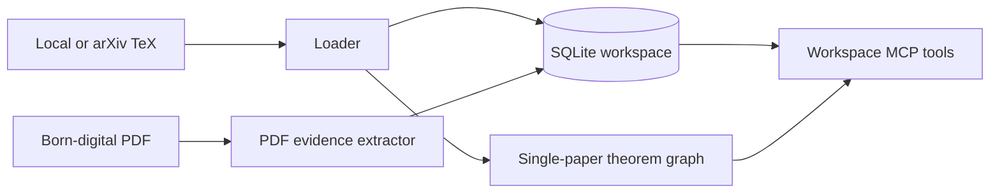

# PaperGraph MCP

[](https://github.com/lotchuazzz-crypto/papergraph-mcp/actions/workflows/ci.yml)
[](https://www.python.org/)
[](LICENSE)
[](https://github.com/lotchuazzz-crypto/papergraph-mcp/releases)

[English](#english) | [中文](#中文)

## English

PaperGraph turns local or arXiv LaTeX papers and born-digital PDFs into an evidence-first theorem workspace for AI agents through MCP. It stores theorem-like results, proof evidence, explicit references, reading queues, reading sessions, and reviewable external import plans in a local SQLite workspace.

PaperGraph v0.9.3 adds review summaries to external import candidates. Before anything is downloaded, an agent can show which local result, proof, citation key, and cited result text justify importing a paper.

### What It Is Good For

- Load a paper once, then query theorem-like results, proofs, dependencies, citations, and source slices repeatedly.
- Build reading paths from explicit proof evidence instead of letting an agent invent a dependency graph.
- Keep external references auditable: PaperGraph proposes imports, but it does not automatically download cited papers.
- Resume a reading project with persistent sessions, notes, checkpoints, and queues.

PaperGraph does not verify proofs, perform semantic theorem matching, or claim that similarly worded results are equivalent.

### Quick Start

Install [uv](https://docs.astral.sh/uv/getting-started/installation/), then verify the pinned GitHub release without cloning:

```powershell
uvx --from git+https://github.com/lotchuazzz-crypto/papergraph-mcp.git@v0.9.3 papergraph-mcp --version
papergraph-mcp doctor
```

The pinned command becomes available after the `v0.9.3` GitHub Release and tag are published. Pinning the tag keeps MCP client installations reproducible.

To validate a raw arXiv request before loading a paper:

```powershell
papergraph-mcp validate-arxiv-request "[math/0307200](https://arxiv.org/abs/2609.01574)"
```

For a compact single-paper check with an already-disambiguated ID, call `load_arxiv_paper(arxiv_id="math/0307200")`. For ordinary user text, call `load_arxiv_request(input="math/0307200")`. PaperGraph selects `main.tex`; a representative first response has `"path": "main.tex"`, `"cached": false`, and `"nodes": 7`.

### Ask your agent to set it up

Give a coding agent this request:

> Clone https://github.com/lotchuazzz-crypto/papergraph-mcp and help me set up PaperGraph for my MCP client. Read the repository's onboarding instructions after cloning.

Compatible agents can follow the repository-local [`setting-up-papergraph`](.agents/skills/setting-up-papergraph/SKILL.md) skill. The agent should show you a reusable PaperGraph prompt, explain why `uv` is needed, and ask before installing software, changing client configuration, or restarting the client.

If your agent clones into a directory that already exists, ask it to run `git fetch --tags origin` before treating the checkout as current. Existing clones can otherwise remain pinned to an old local `origin/main`.

For raw user requests, prefer `load_arxiv_request(input=...)` or `papergraph-mcp load-arxiv-request "..."`. These high-level entry points validate bare IDs, URLs, Markdown links, and prose before loading. To inspect the decision without loading, call `validate_arxiv_request` or `papergraph-mcp validate-arxiv-request "..."`. If validation returns `action: ask_user_to_choose`, ask the user to choose; detecting a conflict and then continuing is a failure. Use `load_arxiv_paper` only after the user has provided one already-disambiguated arXiv ID.

### MCP Configuration

For an MCP client that accepts JSON-style stdio server configuration, add:

```json
{
  "mcpServers": {
    "papergraph": {
      "command": "uvx",
      "args": ["--from", "git+https://github.com/lotchuazzz-crypto/papergraph-mcp.git@v0.9.3", "papergraph-mcp"]
    }
  }
}
```

Restart the MCP client after changing its configuration. The server uses stdio, so running the command without `--help` or `--version` waits quietly for an MCP client connection.

### Core Workflows

| Workflow | Use it when | Main tools |
| --- | --- | --- |
| Load papers | You need local, arXiv, or PDF evidence in a workspace. | `open_workspace`, `workspace_add_local_paper`, `workspace_add_arxiv_paper`, `workspace_add_pdf_paper`, `workspace_list_papers`, `workspace_get_paper` |
| Inspect results | You need theorem statements, proofs, source slices, or citations. | `workspace_list_results`, `workspace_get_result`, `workspace_get_result_proof`, `workspace_get_proof_dependencies`, `workspace_get_external_result_mentions`, `workspace_get_evidence`, `workspace_get_citations`, `workspace_search_theorems` |
| Read a proof | You need source-grounded context and reading order. | `workspace_export_reading_bundle`, `workspace_export_result_reading_context`, `workspace_get_source_slice`, `workspace_get_result_reading_path` |
| Resume reading | You need persistent progress, notes, and checkpoints. | `workspace_create_reading_session`, `workspace_list_reading_sessions`, `workspace_get_reading_session`, `workspace_record_reading_checkpoint`, `workspace_add_reading_note`, `workspace_export_reading_session_summary` |
| Plan reading | You need an ordered queue from a target result. | `workspace_create_reading_queue`, `workspace_list_reading_queues`, `workspace_get_reading_queue`, `workspace_apply_reading_queue_to_session` |
| Plan imports | You need a reviewable list of cited arXiv papers to import next. | `workspace_plan_external_imports_for_result`, `workspace_plan_external_imports_for_queue`, `workspace_plan_external_imports_for_paper` |

The original single-paper tools remain available: `get_environment_diagnostics`, `validate_arxiv_request`, `load_arxiv_request`, `validate_arxiv_input`, `load_paper`, `load_arxiv_paper`, `list_theorems`, `get_theorem`, `get_dependencies`, `get_dependency_diagnostics`, and `where_used`.

Complete workspace tool index: `open_workspace`, `workspace_add_local_paper`, `workspace_add_arxiv_paper`, `workspace_list_papers`, `workspace_get_paper`, `workspace_search_theorems`, `workspace_get_dependencies`, `workspace_get_dependency_diagnostics`, `workspace_get_citations`, `workspace_add_pdf_paper`, `workspace_list_results`, `workspace_get_result`, `workspace_get_result_proof`, `workspace_get_proof_dependencies`, `workspace_get_external_result_mentions`, `workspace_get_evidence`, `workspace_export_reading_bundle`, `workspace_export_result_reading_context`, `workspace_get_source_slice`, `workspace_get_result_reading_path`, `workspace_create_reading_session`, `workspace_list_reading_sessions`, `workspace_get_reading_session`, `workspace_record_reading_checkpoint`, `workspace_add_reading_note`, `workspace_export_reading_session_summary`, `workspace_create_reading_queue`, `workspace_list_reading_queues`, `workspace_get_reading_queue`, `workspace_apply_reading_queue_to_session`, `workspace_plan_external_imports_for_result`, `workspace_plan_external_imports_for_queue`, `workspace_plan_external_imports_for_paper`.

### Tool Reference

| Tool | Returns |
| --- | --- |
| `open_workspace(path)` | Opens or initializes a SQLite workspace and reports schema and graph counts. |
| `workspace_add_local_paper(path, paper_id)` | Imports a local LaTeX paper transactionally. |
| `workspace_add_arxiv_paper(arxiv_id, main_file=None, refresh=False)` | Safely prepares and imports an arXiv LaTeX source package. |
| `workspace_add_pdf_paper(path, paper_id)` | Imports a born-digital PDF with extracted result and proof evidence. |
| `workspace_list_papers()` / `workspace_get_paper(paper_id)` | Lists stored papers or returns one paper's metadata and graph counts. |
| `workspace_search_theorems(query, paper_id=None, kind=None, limit=20)` | Finds theorem-like results by keyword. |
| `workspace_get_dependencies(global_theorem_id, recursive=False)` | Returns direct or recursive dependency records. |
| `workspace_get_dependency_diagnostics(global_theorem_id, recursive=False)` | Explains why dependency extraction did or did not find edges. |
| `workspace_get_citations(paper_id, direction="outgoing", include_unresolved=True)` | Returns explicit incoming or outgoing citation-evidence rows. |
| `workspace_list_results(paper_id=None, kind=None, limit=50)` | Lists stored TeX or PDF evidence results. |
| `workspace_get_result(result_id)` | Returns one stored result with metadata and source spans. |
| `workspace_get_result_proof(result_id)` | Returns proof evidence and source spans for one result. |
| `workspace_get_proof_dependencies(result_id, recursive=False)` | Splits proof dependency evidence into `known`, `inferred`, `unresolved`, and warnings. |
| `workspace_get_external_result_mentions(result_id)` | Lists external result mentions found in proof evidence. |
| `workspace_get_evidence(node_or_edge_id)` | Returns metadata and source spans for a result, proof, dependency, or evidence edge. |
| `workspace_export_reading_bundle(paper_id)` | Exports paper-level Reading Bridge context with mappings and uncertainty logs. |
| `workspace_export_result_reading_context(result_id)` | Exports focused context for deep reading of one result. |
| `workspace_get_source_slice(...)` | Returns bounded source text around a span, result, or proof. |
| `workspace_get_result_reading_path(result_id, recursive=True)` | Builds local reading paths with external and unresolved stop nodes. |
| `workspace_create_reading_session(...)` | Creates a resumable reading session. |
| `workspace_list_reading_sessions(...)` / `workspace_get_reading_session(session_id)` | Lists or restores reading sessions. |
| `workspace_record_reading_checkpoint(...)` | Records reviewed, blocked, queued, or skipped progress. |
| `workspace_add_reading_note(...)` | Adds a note, question, warning, or decision. |
| `workspace_export_reading_session_summary(session_id)` | Exports progress, blocked targets, open questions, notes, and next actions. |
| `workspace_create_reading_queue(result_id, label=None, recursive=True)` | Creates a persistent queue from a target result's reading path. |
| `workspace_list_reading_queues(...)` / `workspace_get_reading_queue(queue_id)` | Lists or restores reading queues. |
| `workspace_apply_reading_queue_to_session(queue_id, session_id, status="queued")` | Applies queue items to a reading session. |
| `workspace_plan_external_imports_for_result(result_id, recursive=True)` | Plans external arXiv imports from one result's reading path. |
| `workspace_plan_external_imports_for_queue(queue_id)` | Plans imports from unresolved external stops in a queue. |
| `workspace_plan_external_imports_for_paper(paper_id)` | Plans imports from all cited arXiv candidates in a paper. |

### Evidence And Reading Notes

PaperGraph v0.4.4 dependency traversal uses `statement_explicit_latex_refs_only`: it follows explicit LaTeX references such as `\ref`, `\eqref`, `\autoref`, `\cref`, and `\Cref` inside theorem-like statements. An empty dependency result means PaperGraph found no resolvable theorem-label references under that rule. It is not evidence that the theorem has no mathematical dependencies.

Proof dependency extraction is evidence-scoped. PaperGraph looks inside TeX proof environments, direct proof continuations, and short text immediately following a theorem-like result. It reports explicit references, simple inferred local references, and unresolved mentions separately. It does not infer unstated mathematical prerequisites.

Kind metadata is intentionally explicit:

- `raw_kind`: what the source extractor found.
- `display_kind`: the user-facing type label.
- `normalized_kind`: the stable grouping key used by tools.

### CLI Shortcuts

Most workspace operations are available from the CLI with `--workspace`:

```powershell
papergraph-mcp --workspace .\papergraph.sqlite3 export-reading-bundle local:paper-a
papergraph-mcp --workspace .\papergraph.sqlite3 export-result-reading-context local:paper-a::thm:main
papergraph-mcp --workspace .\papergraph.sqlite3 get-source-slice --result-id local:paper-a::thm:main
papergraph-mcp --workspace .\papergraph.sqlite3 get-result-reading-path local:paper-a::thm:main
papergraph-mcp --workspace .\papergraph.sqlite3 create-reading-session local:paper-a
papergraph-mcp --workspace .\papergraph.sqlite3 record-reading-checkpoint SESSION result local:paper-a::thm:main reviewed
papergraph-mcp --workspace .\papergraph.sqlite3 add-reading-note SESSION "Need to check the cited fixed point theorem."
papergraph-mcp --workspace .\papergraph.sqlite3 export-reading-session-summary SESSION
papergraph-mcp --workspace .\papergraph.sqlite3 create-reading-queue local:paper-a::thm:main
papergraph-mcp --workspace .\papergraph.sqlite3 list-reading-queues
papergraph-mcp --workspace .\papergraph.sqlite3 get-reading-queue QUEUE
papergraph-mcp --workspace .\papergraph.sqlite3 apply-reading-queue-to-session QUEUE SESSION
papergraph-mcp --workspace .\papergraph.sqlite3 plan-external-imports-for-result local:paper-a::thm:main
papergraph-mcp --workspace .\papergraph.sqlite3 plan-external-imports-for-queue QUEUE
papergraph-mcp --workspace .\papergraph.sqlite3 plan-external-imports-for-paper local:paper-a
```

### Local Three-Paper Walkthrough

The repository includes a small fixture under `tests/fixtures/workspace_tex_project/`. A typical local demo imports `paper_a`, `paper_b`, and `paper_c`, then searches for `fixed point`:

- `workspace_search_theorems("fixed point")` returns `local:paper-a::thm:main`, `local:paper-b::thm:main`, and `local:paper-c::thm:main`.
- `workspace_get_citations("local:paper-a", direction="outgoing", include_unresolved=True)` reports citation keys `absent`, `missing`, and `paper-b`.
- The `paper-b` citation has cited arXiv ID `2401.12346`, but it does not resolve to `local:paper-b`; the row keeps `target_paper_id: null`.
- To create a resolved target, the cited arXiv ID is imported with `workspace_add_arxiv_paper`. A local paper with a similar bibliography entry is not enough; citation resolution is based on explicit cited arXiv ID evidence.

### Architecture



### Safety And Privacy

PaperGraph only constructs remote downloads from arXiv's fixed e-print endpoint; arbitrary URLs are not accepted. It limits compressed responses to **100 MiB**, expanded content to **500 MiB**, and archives to **10,000** members. Absolute paths, parent traversal, symbolic links, hard links, devices, FIFOs, and other special archive members are rejected.

Workspaces are ordinary local SQLite files. Local PDFs remain local. Extracted PDF text, source spans, and proof evidence are written only to the workspace you choose. Do not commit databases, private manuscripts, cache data, credentials, tokens, generated distributions, or raw local logs.

### Release Highlights

- v0.9.3 added external import review summaries.
- v0.9.2 improved cited-result mention extraction.
- v0.9.1 added proof-adjacent dependency evidence.
- v0.9.0 introduced reading queues, sessions, and external import planning.
- v0.4.0 introduced cross-paper SQLite workspaces with `workspace_add_arxiv_paper`, `workspace_search_theorems`, and `workspace_get_citations`. Resolution remains explicit, not semantic.

### Development

```powershell
uv sync
uv run pytest -q -p no:cacheprovider
```

The automated suite uses synthetic archives, projects, bibliography entries, and PDFs. It does not require the live arXiv service.

### Limitations

- PDF extraction is best for born-digital PDFs; scanned PDFs or OCR-heavy files may produce sparse text and missing evidence.
- PaperGraph does not verify proofs and does not perform semantic theorem matching.
- Proof references and citations are not automatically followed across the whole literature. Agents should use import plans to decide what source to inspect next.
- Citation resolution uses explicit bibliography identifiers and evidence, not guesses from similar titles, authors, or theorem wording.
- Complex projects may need an explicit `main_file`; the parser is not a full TeX engine.

### Contributing And License

Bug reports, research-reading workflows, reproducible fixtures, and PRs are welcome. Please read [Contributing](CONTRIBUTING.md) before submitting changes. PaperGraph is released under the [MIT License](LICENSE).

## 中文

PaperGraph MCP 把本地或 arXiv 的 LaTeX 论文、born-digital PDF 转成“证据优先”的定理阅读工作区。它通过 MCP 暴露工具，让 agent 可以查询 theorem-like results、proof evidence、显式引用、阅读队列、阅读会话，以及可审阅的外部论文导入计划。

v0.9.3 的重点是 external import review summaries：在下载外部论文之前，agent 可以先说明是哪一个本地结果、哪段 proof、哪个 citation key、哪段 cited result text 支持这次导入建议。

### 适合做什么

- 一次加载论文，反复查询定理、命题、证明、依赖、引用和源码片段。
- 根据显式 proof evidence 生成阅读顺序，而不是让 agent 猜依赖图。
- 把外部引用保持为可审阅计划：PaperGraph 只提出候选，不自动下载引用论文。
- 用阅读会话、笔记、checkpoint 和 queue 继续长期阅读项目。

PaperGraph does not verify proofs，也不做 semantic theorem matching；它不会声称两个措辞相似的结果数学上等价。

### 快速开始

先安装 [uv](https://docs.astral.sh/uv/getting-started/installation/)，然后直接验证固定版本：

```powershell
uvx --from git+https://github.com/lotchuazzz-crypto/papergraph-mcp.git@v0.9.3 papergraph-mcp --version
papergraph-mcp doctor
```

这个固定命令需要 `v0.9.3` GitHub Release 和 tag 已经发布。固定 tag 可以让 MCP client 的安装更可复现。

加载论文前，可以先验证一段原始 arXiv 请求：

```powershell
papergraph-mcp validate-arxiv-request "[math/0307200](https://arxiv.org/abs/2609.01574)"
```

如果你已经有单一、无歧义的 arXiv ID，可以调用 `load_arxiv_paper(arxiv_id="math/0307200")`。如果输入来自普通用户提示词，优先调用 `load_arxiv_request(input="math/0307200")`。PaperGraph 会选择 `main.tex`；一个典型首次响应包含 `"path": "main.tex"`、`"cached": false` 和 `"nodes": 7`。

### 让 agent 帮你设置

你可以把这段话发给 coding agent：

> Clone https://github.com/lotchuazzz-crypto/papergraph-mcp and help me set up PaperGraph for my MCP client. Read the repository's onboarding instructions after cloning.

支持本仓库 skill 的 agent 会读取 [`setting-up-papergraph`](.agents/skills/setting-up-papergraph/SKILL.md)，展示可复用提示词，解释为什么需要 `uv`，并在安装软件、修改客户端配置或重启客户端前询问你。

如果目标目录已经存在，请让 agent 先运行 `git fetch --tags origin`，再判断仓库是否是最新。否则已有 clone 可能仍停留在旧的本地 `origin/main`。

普通用户请求优先走 `load_arxiv_request(input=...)` 或 `papergraph-mcp load-arxiv-request "..."`。这些入口会在加载前验证 bare IDs、URLs、Markdown links 和自然语言描述。若验证返回 `action: ask_user_to_choose`，必须让用户选择；detecting a conflict and then continuing is a failure。Use `load_arxiv_paper` only after 用户已经给出单一、无歧义的 arXiv ID。

### MCP 配置

如果你的 MCP client 使用 JSON 风格的 stdio server 配置，可以添加：

```json
{
  "mcpServers": {
    "papergraph": {
      "command": "uvx",
      "args": ["--from", "git+https://github.com/lotchuazzz-crypto/papergraph-mcp.git@v0.9.3", "papergraph-mcp"]
    }
  }
}
```

修改配置后重启 MCP client。这个 server 使用 stdio，所以不带 `--help` 或 `--version` 直接运行时，会安静等待 MCP client 连接。

### 主要工作流

| 工作流 | 什么时候用 | 主要工具 |
| --- | --- | --- |
| 导入论文 | 把本地、arXiv 或 PDF 论文放进工作区。 | `open_workspace`, `workspace_add_local_paper`, `workspace_add_arxiv_paper`, `workspace_add_pdf_paper`, `workspace_list_papers`, `workspace_get_paper` |
| 检查结果 | 需要定理陈述、证明、源码片段或引用。 | `workspace_list_results`, `workspace_get_result`, `workspace_get_result_proof`, `workspace_get_proof_dependencies`, `workspace_get_external_result_mentions`, `workspace_get_evidence`, `workspace_get_citations`, `workspace_search_theorems` |
| 阅读证明 | 需要带源码证据的上下文和阅读顺序。 | `workspace_export_reading_bundle`, `workspace_export_result_reading_context`, `workspace_get_source_slice`, `workspace_get_result_reading_path` |
| 继续阅读 | 需要保存进度、笔记和 checkpoint。 | `workspace_create_reading_session`, `workspace_list_reading_sessions`, `workspace_get_reading_session`, `workspace_record_reading_checkpoint`, `workspace_add_reading_note`, `workspace_export_reading_session_summary` |
| 规划阅读 | 从目标结果生成有序阅读队列。 | `workspace_create_reading_queue`, `workspace_list_reading_queues`, `workspace_get_reading_queue`, `workspace_apply_reading_queue_to_session` |
| 规划导入 | 生成可审阅的外部 arXiv 导入候选。 | `workspace_plan_external_imports_for_result`, `workspace_plan_external_imports_for_queue`, `workspace_plan_external_imports_for_paper` |

原有单论文工具仍可使用：`get_environment_diagnostics`, `validate_arxiv_request`, `load_arxiv_request`, `validate_arxiv_input`, `load_paper`, `load_arxiv_paper`, `list_theorems`, `get_theorem`, `get_dependencies`, `get_dependency_diagnostics`, `where_used`。

### 证据与阅读说明

PaperGraph v0.4.4 的 statement 依赖遍历使用 `statement_explicit_latex_refs_only`：只跟踪 theorem-like statement 里的显式 LaTeX 引用，例如 `\ref`、`\eqref`、`\autoref`、`\cref`、`\Cref`。空依赖结果只表示在这个规则下没有解析到标签引用；这不是“该定理没有数学依赖”的证据。

Proof dependency extraction 只按证据工作。PaperGraph 会检查 TeX proof environments、直接的 proof continuation，以及 immediately preceding result 附近的短文本。它会把明确引用、简单推断出的本地引用和 unresolved mentions 分开报告，不推断未写出的数学前置知识。

kind 信息分三层：

- `raw_kind`：source extractor 看到的原始类型。
- `display_kind`：面向用户展示的类型。
- `normalized_kind`：工具内部稳定使用的分组键。

### 本地三论文示例

仓库里的 `tests/fixtures/workspace_tex_project/` 包含一个小型 fixture。典型流程是导入 `paper_a`、`paper_b`、`paper_c`，然后搜索 `fixed point`：

- `workspace_search_theorems("fixed point")` 返回 `local:paper-a::thm:main`、`local:paper-b::thm:main`、`local:paper-c::thm:main`。
- `workspace_get_citations("local:paper-a", direction="outgoing", include_unresolved=True)` 报告 citation keys：`absent`、`missing`、`paper-b`。
- `paper-b` citation 有 cited arXiv ID `2401.12346`，但它 does not resolve to `local:paper-b`；该行保留 `target_paper_id: null`。
- 只有通过 `workspace_add_arxiv_paper` 导入 cited arXiv ID 后，才会创建可解析的目标。本地论文里有相似 bibliography entry 并不足够；citation resolution 基于显式 cited arXiv ID evidence。

### 安全与隐私

PaperGraph 只从 arXiv 固定 e-print endpoint 构造远程下载；arbitrary URLs are not accepted。压缩响应限制为 **100 MiB**，展开内容限制为 **500 MiB**，archive 成员数量限制为 **10,000**。绝对路径、父目录穿越、符号链接、硬链接、设备文件和其他特殊 archive member 会被拒绝。

workspace 是普通本地 SQLite 文件。Local PDFs remain local。抽取出的 PDF 文本、source spans 和 proof evidence 只写入你选择的 workspace。不要提交数据库、private manuscripts、cache data、credentials、tokens、generated distributions 或本地日志。

### 开发

```powershell
uv sync
uv run pytest -q -p no:cacheprovider
```

自动化测试使用合成 archive、project、bibliography 和 PDF，不依赖 live arXiv service。

### 限制

- PDF 抽取最适合 born-digital PDFs；scanned PDFs 或 OCR-heavy 文件可能只有稀疏文本或缺失证据。
- PaperGraph does not verify proofs，也不做 semantic theorem matching。
- proof references 和 citations 不会自动递归追完整个文献网络；你需要用 import plans 决定下一步检查哪些 source。
- Citation resolution 只使用显式 bibliography identifiers and evidence，不根据相似标题、作者或 theorem wording 猜测。
- 复杂项目结构可能需要显式 `main_file`；parser 不是完整 TeX engine。

### 贡献与许可证

欢迎提交 bug report、论文阅读工作流、可复现 fixture 和 PR。提交前请阅读 [Contributing](CONTRIBUTING.md)。PaperGraph 使用 [MIT License](LICENSE)。
