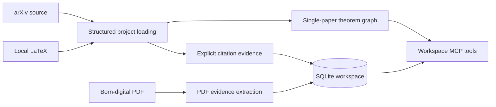

# PaperGraph MCP

[](https://github.com/lotchuazzz-crypto/papergraph-mcp/actions/workflows/ci.yml)
[](https://www.python.org/)
[](LICENSE)
[](https://github.com/lotchuazzz-crypto/papergraph-mcp/releases)

PaperGraph turns local or arXiv LaTeX papers and born-digital PDFs into evidence-first theorem, result, proof, reading-session, reading-queue, and external-import planning state that AI agents can query through MCP. PaperGraph v0.9.2 extracts conservative proof-roadmap phrases such as "It remains to prove Lemmas 1 and 2," so explicit local subresult plans can feed reading paths without semantic guesswork.

PaperGraph v0.9.1 associated TeX proof environments to the immediately preceding result, so proof-local label references can feed reading paths instead of reporting `proof: not_found`.

PaperGraph v0.9.0 added an External Import Planner so agents can turn external proof stops and citation evidence into a deterministic list of arXiv papers to import next.

PaperGraph v0.8.0 added a persistent Reading Queue Planner so agents can turn local proof-dependency paths into required, recommended, and caution reading targets, then apply those targets to resumable reading sessions.

PaperGraph v0.7.0 added persistent Reading Session State so agents can resume which evidence targets were reviewed, blocked, queued, or left as open questions.

PaperGraph v0.6.1 added command-line Reading Bridge exports so terminal workflows and CI scripts can inspect bridge payloads from an existing workspace without starting MCP.

PaperGraph v0.6.0 added Reading Bridge MCP tools, bounded source slices, focused result contexts, and local reading paths so explanation-focused consumers can build on explicit evidence without silently inventing interpretation.

PaperGraph v0.5.0 added PDF import plus proof evidence tools that separate known local and external support, proof association metadata, unresolved references, and parser warnings before an agent interprets a proof.

PaperGraph v0.4.0 introduced the persistent, cross-paper SQLite workspace: retain a small literature collection, search theorem text, follow theorem dependencies, and inspect citation evidence without asking an agent to re-read every source paper.

## Why PaperGraph?

Single-paper tools expose theorem-like environments, labels, and `\ref` relationships. A workspace keeps many independently imported papers together. It is deliberately evidence-first: every citation result identifies the source paper, bibliography key, LaTeX command, source file, and resolution status. This is useful for grounded reading and review; it is not semantic theorem matching or a claim that two similarly worded results are equivalent.

## Features

- Load local single-file or multi-file LaTeX projects, or safely prepare arXiv source projects.
- Import born-digital PDFs into the same local workspace and inspect extracted result and proof evidence.
- Associate TeX proof environments with the immediately preceding result, expose proof-local references, and extract conservative proof-roadmap phrases.
- Export reading bridge bundles, result contexts, source slices, and reading paths for explanation-focused consumers.
- Persist reading sessions, checkpoints, notes, open questions, and recovery summaries in the local workspace.
- Plan deterministic reading queues from proof-dependency evidence and apply them to reading sessions.
- Plan external arXiv imports from reading-path stops, reading queues, or paper-level citation evidence.
- Keep theorem, reference, and citation records in a local SQLite workspace.
- Search theorem titles and bodies across papers, with stable global IDs.
- Traverse direct or recursive theorem dependencies and inspect incoming or outgoing citation evidence, including unresolved citations.
- Preserve the active single-paper graph and active workspace independently.

## Ask your agent to set it up

Give a coding agent this request:

> Clone https://github.com/lotchuazzz-crypto/papergraph-mcp and help me set up PaperGraph for my MCP client. Read the repository's onboarding instructions after cloning.

Compatible agents can follow the repository-local
[`setting-up-papergraph`](.agents/skills/setting-up-papergraph/SKILL.md)
skill. The agent should show you a reusable PaperGraph prompt, explain why `uv`
is needed, and ask before installing software, changing client configuration, or
restarting the client. You can always use the manual setup below instead.

If your agent clones into a directory that already exists, ask it to run
`git fetch --tags origin` before treating the checkout as current. Existing
clones can otherwise remain pinned to an old local `origin/main`.

For raw user requests, prefer `load_arxiv_request(input=...)` or
`papergraph-mcp load-arxiv-request "..."`. These high-level entry points
validate bare IDs, URLs, Markdown links, and prose before loading. To inspect
the decision without loading, call `validate_arxiv_request` or
`papergraph-mcp validate-arxiv-request "..."`. If validation returns
`action: ask_user_to_choose`, ask the user to choose; detecting a conflict and then continuing is a failure. Use `load_arxiv_paper` only after the user has provided one already-disambiguated arXiv ID.

## Quick Start

Install [uv](https://docs.astral.sh/uv/getting-started/installation/), then verify the GitHub release without cloning the repository:

```powershell
uvx --from git+https://github.com/lotchuazzz-crypto/papergraph-mcp.git@v0.9.2 papergraph-mcp --version
papergraph-mcp doctor
```

The pinned command becomes available after the `v0.9.2` GitHub Release and tag are published. Pinning the tag keeps MCP client installations reproducible.

To validate a raw arXiv request before loading a paper, run:

```powershell
papergraph-mcp validate-arxiv-request "[math/0307200](https://arxiv.org/abs/2609.01574)"
```

## MCP Configuration

For an MCP client that accepts JSON-style stdio server configuration, add:

```json
{
  "mcpServers": {
    "papergraph": {
      "command": "uvx",
      "args": ["--from", "git+https://github.com/lotchuazzz-crypto/papergraph-mcp.git@v0.9.2", "papergraph-mcp"]
    }
  }
}
```

Restart the MCP client after changing its configuration. The server uses stdio, so running the command without `--help` or `--version` waits quietly for an MCP client connection.

## Tools

The original single-paper tools remain available: `get_environment_diagnostics`, `validate_arxiv_request`, `load_arxiv_request`, `validate_arxiv_input`, `load_paper`, `load_arxiv_paper`, `list_theorems`, `get_theorem`, `get_dependencies`, `get_dependency_diagnostics`, and `where_used`. Their signatures are `get_environment_diagnostics()`, `validate_arxiv_request(input: str)`, `load_arxiv_request(input: str, main_file: str | None = None, refresh: bool = False)`, `validate_arxiv_input(text_id: str | None = None, url: str | None = None)`, `load_paper(path: str)`, `load_arxiv_paper(arxiv_id: str, main_file: str | None = None, refresh: bool = False)`, `list_theorems(kind: str | None = None)`, `get_theorem(theorem_id: str)`, `get_dependencies(theorem_id: str, recursive: bool = False)`, `get_dependency_diagnostics(theorem_id: str, recursive: bool = False)`, and `where_used(theorem_id: str)`.

Workspace tools operate on the active database. Call `open_workspace` first: `workspace_add_local_paper`, `workspace_add_arxiv_paper`, `workspace_add_pdf_paper`, `workspace_list_papers`, `workspace_get_paper`, `workspace_search_theorems`, `workspace_get_dependencies`, `workspace_get_dependency_diagnostics`, `workspace_get_citations`, `workspace_list_results`, `workspace_get_result`, `workspace_get_result_proof`, `workspace_get_proof_dependencies`, `workspace_get_external_result_mentions`, `workspace_get_evidence`, `workspace_export_reading_bundle`, `workspace_export_result_reading_context`, `workspace_get_source_slice`, `workspace_get_result_reading_path`, `workspace_create_reading_session`, `workspace_list_reading_sessions`, `workspace_get_reading_session`, `workspace_record_reading_checkpoint`, `workspace_add_reading_note`, `workspace_export_reading_session_summary`, `workspace_create_reading_queue`, `workspace_list_reading_queues`, `workspace_get_reading_queue`, `workspace_apply_reading_queue_to_session`, `workspace_plan_external_imports_for_result`, `workspace_plan_external_imports_for_queue`, and `workspace_plan_external_imports_for_paper` require that active workspace. Their exact MCP signatures and return summaries are:

| Tool signature | Returns |
| --- | --- |
| `open_workspace(path: str) -> dict` | Resolved SQLite path, schema version, and paper/theorem counts. Opens an existing workspace or initializes one. |
| `workspace_add_local_paper(path: str, paper_id: str) -> dict` | Imported paper metadata, theorem/kind counts, citation count, and unresolved-citation count. Re-importing an ID replaces it transactionally. |
| `get_dependency_diagnostics(theorem_id: str, recursive: bool = False) -> dict` | Extraction basis, referenced labels, resolved and unresolved labels, dependency IDs, and warnings for sparse results. |
| `workspace_add_arxiv_paper(arxiv_id: str, main_file: str | None = None, refresh: bool = False) -> dict` | The same import summary after safe arXiv preparation; paper ID and source version are normalized. |
| `workspace_add_pdf_paper(path: str, paper_id: str) -> dict` | Imported PDF paper metadata, result counts, extracted evidence counts, and warnings. Re-importing an ID replaces it transactionally. |
| `workspace_list_papers() -> list[dict]` | Stored-paper metadata and graph counts, in stable paper-ID order. |
| `workspace_get_paper(paper_id: str) -> dict` | One paper's metadata, theorem/kind counts, resolved incoming/outgoing citation counts, and unresolved count. |
| `workspace_search_theorems(query: str, paper_id: str | None = None, kind: str | None = None, limit: int = 20) -> list[dict]` | Matching global ID, paper/local IDs, kind, title, source file, and bounded content excerpt. Empty queries fail; `limit` is 1–100. |
| `workspace_get_dependencies(global_theorem_id: str, recursive: bool = False) -> list[dict]` | Direct or cycle-safe recursive dependency records for a globally identified theorem. |
| `workspace_get_dependency_diagnostics(global_theorem_id: str, recursive: bool = False) -> dict` | The same diagnostic contract for a globally identified theorem in the active workspace. |
| `workspace_get_citations(paper_id: str, direction: str = "outgoing", include_unresolved: bool = True) -> list[dict]` | Explicit incoming or outgoing citation-evidence rows. Direction is `incoming` or `outgoing`; incoming rows are resolved. |
| `workspace_list_results(paper_id: str | None = None, kind: str | None = None, limit: int = 50) -> list[dict]` | Stored TeX or PDF evidence results with IDs, paper IDs, kinds, visible numbers, and bounded ordering. |
| `workspace_get_result(result_id: str) -> dict` | One stored evidence result with metadata and source spans. |
| `workspace_get_result_proof(result_id: str) -> dict` | Proof evidence for a stored TeX or PDF evidence result, including the proof span when one was extracted. |
| `workspace_get_proof_dependencies(result_id: str, recursive: bool = False) -> dict` | Proof dependency evidence split into `known`, `inferred`, `unresolved`, and `warnings`. |
| `workspace_get_external_result_mentions(result_id: str) -> list[dict]` | External result mentions found in a result's proof evidence. |
| `workspace_get_evidence(node_or_edge_id: str) -> dict` | Metadata and source spans for one result, proof, dependency, or evidence edge. |
| `workspace_export_reading_bundle(paper_id: str) -> dict` | Paper-level Reading Bridge bundle with results, AI4Math-like entities, dependency evidence, URI mappings, source handles, uncertainty logs, and interpretation policy. |
| `workspace_export_result_reading_context(result_id: str) -> dict` | Focused result context for deep reading, including statement evidence, proof evidence, dependencies, source-slice handles, and allowed consumer interpretation prompts. |
| `workspace_get_source_slice(span_id: str | None = None, result_id: str | None = None, proof_id: str | None = None, context: int = 1) -> dict` | Bounded source text around exactly one span, result, or proof selector. `context` is 0 through 5 neighboring source spans. |
| `workspace_get_result_reading_path(result_id: str, recursive: bool = True) -> dict` | Top-down and bottom-up local reading paths derived from resolved proof dependencies, with external and unresolved stop nodes. |
| `workspace_create_reading_session(paper_id: str, label: str | None = None, target_result_id: str | None = None) -> dict` | Creates an active reading session for a stored paper or target result, with checkpoint and note counts. |
| `workspace_list_reading_sessions(paper_id: str | None = None, status: str | None = None) -> list[dict]` | Lists sessions ordered for resumption, optionally filtered by paper or status. |
| `workspace_get_reading_session(session_id: str) -> dict` | Returns one session with deterministic checkpoint and note lists. |
| `workspace_record_reading_checkpoint(session_id: str, target_kind: str, target_id: str, status: str, summary: str = "", evidence: dict | None = None) -> dict` | Creates or updates a reviewed, blocked, queued, or skipped reading checkpoint for one explicit target. |
| `workspace_add_reading_note(session_id: str, text: str, note_type: str = "note", target_kind: str | None = None, target_id: str | None = None) -> dict` | Adds a note, question, warning, or decision to a session and optional target. |
| `workspace_export_reading_session_summary(session_id: str) -> dict` | Exports recovery progress, reviewed targets, blocked targets, open questions, latest notes, and deterministic next-action hints. |
| `workspace_create_reading_queue(result_id: str, label: str | None = None, recursive: bool = True) -> dict` | Creates a persistent reading queue from a result's local reading path, proof evidence, external stops, and unresolved stops. |
| `workspace_list_reading_queues(paper_id: str | None = None, status: str | None = None) -> list[dict]` | Lists queues ordered for resumption, optionally filtered by paper or active/archived status. |
| `workspace_get_reading_queue(queue_id: str) -> dict` | Returns one queue with deterministic required, recommended, and caution item ordering. |
| `workspace_apply_reading_queue_to_session(queue_id: str, session_id: str, status: str = "queued") -> dict` | Applies queue items as reading-session checkpoints with queue provenance. |
| `workspace_plan_external_imports_for_result(result_id: str, recursive: bool = True) -> dict` | Plans external arXiv imports from one result's reading path, preserving blocked stops without arXiv IDs. |
| `workspace_plan_external_imports_for_queue(queue_id: str) -> dict` | Plans external arXiv imports from saved reading queue caution items. |
| `workspace_plan_external_imports_for_paper(paper_id: str) -> dict` | Plans external arXiv imports from paper-level citation and external mention evidence. |

For a compact single-paper check with an already-disambiguated ID, call `load_arxiv_paper(arxiv_id="math/0307200")`. For ordinary user text, call `load_arxiv_request(input="math/0307200")`. PaperGraph selects `main.tex`; a representative first response has `"path": "main.tex"`, `"cached": false`, and `"nodes": 7`.

## Reading Sparse Dependency Results

PaperGraph v0.4.4 dependency traversal uses `statement_explicit_latex_refs_only`:
it follows explicit LaTeX references such as `\ref`, `\eqref`, `\autoref`,
`\cref`, and `\Cref` inside theorem-like statements. An empty dependency result
means PaperGraph found no resolvable theorem-label references under that rule.
It is not evidence that the theorem has no mathematical dependencies.

Theorem summaries include `kind`, `raw_kind`, `display_kind`, and
`normalized_kind`. Use `display_kind` for human-facing labels and
`normalized_kind` for grouping; `kind` remains the raw LaTeX environment name
for compatibility.

## PDF proof evidence workflow

Use PDF import when you have a born-digital PDF and want a local, evidence-first view of extracted results and proof references. The PDF tools store source spans so an agent can show where a theorem, proof, or dependency mention came from before drawing conclusions.

```text
open_workspace(path="C:/Temp/papergraph-pdf.sqlite3")
workspace_add_pdf_paper(path="C:/Papers/example.pdf", paper_id="local:example")
workspace_list_results(paper_id="local:example")
workspace_get_result_proof(result_id="local:example::pdf:theorem:1.1")
workspace_get_proof_dependencies(result_id="local:example::pdf:theorem:1.1")
```

Dependency responses split evidence into `known`, `inferred`, `unresolved`, and `warnings`. `known` covers resolved local results with their proof mentions, resolved external result mentions, and bibliography-backed external mentions in `known.external_result_mentions`. `inferred` reports proof association metadata, such as how confidently a proof block was associated with the result. `unresolved` covers references that remain ambiguous or missing after extraction. `warnings` report low-confidence extraction boundaries and other cases where an agent should slow down before interpreting the result.

PaperGraph does not verify proofs. It extracts and stores evidence so an agent can inspect the text, source spans, and dependency status without silently upgrading a mention into a mathematical fact.

## Reading Bridge workflow

Use the Reading Bridge when you want PaperGraph to provide evidence and source handles for a separate paper-reading skill or agent. PaperGraph exports the extracted statements, proof evidence, dependency buckets, unresolved mentions, warnings, and bounded source slices. AI4Math-Paper-Reading or another consumer should perform plain-language explanation, proof-gap filling, symbol tables, and interpretation after it states which parts came from PaperGraph evidence.

```text
open_workspace(path="C:/Temp/papergraph-reading.sqlite3")
workspace_add_pdf_paper(path="C:/Papers/example.pdf", paper_id="local:example")
workspace_export_reading_bundle(paper_id="local:example")
workspace_export_result_reading_context(result_id="local:example::pdf:theorem:1.1")
workspace_get_source_slice(proof_id="local:example::proof:1", context=1)
workspace_get_result_reading_path(result_id="local:example::pdf:theorem:1.1", recursive=True)
```

The same Reading Bridge payloads can be exported from a shell after the
workspace already contains the paper:

```powershell
papergraph-mcp export-reading-bundle --workspace C:/Temp/papergraph-reading.sqlite3 --paper-id local:example
papergraph-mcp export-result-reading-context --workspace C:/Temp/papergraph-reading.sqlite3 --result-id local:example::pdf:theorem:1.1
papergraph-mcp get-source-slice --workspace C:/Temp/papergraph-reading.sqlite3 --proof-id local:example::proof:1 --context 1
papergraph-mcp get-result-reading-path --workspace C:/Temp/papergraph-reading.sqlite3 --result-id local:example::pdf:theorem:1.1
```

Bridge payloads include `bridge_schema_version`, reversible PaperGraph-to-reading URI maps, AI4Math-like `entities`, `dependency_index`, `external_mentions`, `source_handles`, `completeness_check`, `uncertain_log`, and an `interpretation_policy`. Fields such as `paper_summary`, proof-gap filling, main-result detection, and proof strategy narration are marked for the consumer instead of being generated by PaperGraph.

## Reading session workflow

Use Reading Session State when a paper-reading agent should resume from explicit progress instead of starting from a fresh bundle. PaperGraph stores session metadata, checkpoints, notes, questions, and source-handle provenance; it does not store generated theorem explanations or claim that a proof has been verified.

```text
open_workspace(path="C:/Temp/papergraph-reading.sqlite3")
workspace_create_reading_session(paper_id="local:example", label="Main theorem pass", target_result_id="local:example::pdf:theorem:1.1")
workspace_record_reading_checkpoint(session_id="session:...", target_kind="result_id", target_id="local:example::pdf:theorem:1.1", status="reviewed", summary="Statement and proof source slice reviewed.")
workspace_add_reading_note(session_id="session:...", text="Check whether the bootstrap lemma needs an external estimate.", note_type="question")
workspace_export_reading_session_summary(session_id="session:...")
```

The same state workflow can be used from a shell against an existing workspace:

```powershell
papergraph-mcp create-reading-session --workspace C:/Temp/papergraph-reading.sqlite3 --paper-id local:example --label "Main theorem pass" --target-result-id local:example::pdf:theorem:1.1
papergraph-mcp record-reading-checkpoint --workspace C:/Temp/papergraph-reading.sqlite3 --session-id session:... --target-kind result_id --target-id local:example::pdf:theorem:1.1 --status reviewed --summary "Statement and proof source slice reviewed."
papergraph-mcp add-reading-note --workspace C:/Temp/papergraph-reading.sqlite3 --session-id session:... --text "Check whether the bootstrap lemma needs an external estimate." --note-type question
papergraph-mcp export-reading-session-summary --workspace C:/Temp/papergraph-reading.sqlite3 --session-id session:...
```

Session summaries include progress counts, reviewed targets, blocked targets, open questions, latest notes, and deterministic next-action hints such as `review_blocked_targets` or `continue_queued_targets`. The hints are reading-state cues, not mathematical advice.

## Reading queue workflow

Use the Reading Queue Planner when a paper-reading agent should start from a selected result and receive an explicit, ordered set of reading targets. Queue items are deterministic: the selected result and its proof are `required`, local proof dependencies and their proofs are `recommended`, and external or unresolved stops are `caution`.

```text
open_workspace(path="C:/Temp/papergraph-reading.sqlite3")
workspace_create_reading_queue(result_id="local:example::pdf:theorem:1.1", label="Main theorem queue")
workspace_get_reading_queue(queue_id="queue:...")
workspace_create_reading_session(paper_id="local:example", label="Main theorem pass", target_result_id="local:example::pdf:theorem:1.1")
workspace_apply_reading_queue_to_session(queue_id="queue:...", session_id="session:...")
workspace_export_reading_session_summary(session_id="session:...")
```

The same queue workflow can be used from a shell against an existing workspace:

```powershell
papergraph-mcp create-reading-queue --workspace C:/Temp/papergraph-reading.sqlite3 --result-id local:example::pdf:theorem:1.1 --label "Main theorem queue"
papergraph-mcp list-reading-queues --workspace C:/Temp/papergraph-reading.sqlite3 --paper-id local:example
papergraph-mcp get-reading-queue --workspace C:/Temp/papergraph-reading.sqlite3 --queue-id queue:...
papergraph-mcp apply-reading-queue-to-session --workspace C:/Temp/papergraph-reading.sqlite3 --queue-id queue:... --session-id session:...
```

Reading queues do not verify proofs or generate theorem explanations. They preserve the evidence-derived order and stop reasons so a reading agent can inspect, explain, or defer each target without silently inventing missing dependencies.

## External import planner workflow

Use the External Import Planner when a reading path or queue reaches external stops and the next question is which cited arXiv papers should be imported into the workspace. The planner is read-only: it groups stored external mentions, citation mentions, and bibliography entries into `import_candidate` or `already_imported` arXiv candidates, and keeps non-actionable evidence in `blocked`.

```text
open_workspace(path="C:/Temp/papergraph-reading.sqlite3")
workspace_plan_external_imports_for_result(result_id="local:example::pdf:theorem:1.1")
workspace_create_reading_queue(result_id="local:example::pdf:theorem:1.1")
workspace_plan_external_imports_for_queue(queue_id="queue:...")
workspace_plan_external_imports_for_paper(paper_id="local:example")
```

The same planner can be used from a shell against an existing workspace:

```powershell
papergraph-mcp plan-external-imports-for-result --workspace C:/Temp/papergraph-reading.sqlite3 --result-id local:example::pdf:theorem:1.1
papergraph-mcp plan-external-imports-for-result --workspace C:/Temp/papergraph-reading.sqlite3 --result-id local:example::pdf:theorem:1.1 --direct
papergraph-mcp plan-external-imports-for-queue --workspace C:/Temp/papergraph-reading.sqlite3 --queue-id queue:...
papergraph-mcp plan-external-imports-for-paper --workspace C:/Temp/papergraph-reading.sqlite3 --paper-id local:example
```

External import plans do not download papers, call live arXiv, resolve DOI-only references, or match external theorem numbers to local theorem statements. They only make the next import decision auditable.

## Three-paper local walkthrough

Clone this repository so the tracked synthetic fixtures are available, then use a temporary database path outside the repository (for example, `$env:TEMP/papergraph-demo.sqlite3` on Windows). In your MCP client, call these tools in order; the only values that vary by checkout are the three absolute fixture paths.

```text
open_workspace(path="C:/Temp/papergraph-demo.sqlite3")
workspace_add_local_paper(path=".../papergraph-mcp/tests/fixtures/workspace/paper_a/main.tex", paper_id="local:paper-a")
workspace_add_local_paper(path=".../papergraph-mcp/tests/fixtures/workspace/paper_b/main.tex", paper_id="local:paper-b")
workspace_add_local_paper(path=".../papergraph-mcp/tests/fixtures/workspace/paper_c/main.tex", paper_id="local:paper-c")
workspace_list_papers()
workspace_search_theorems(query="fixed point", limit=10)
workspace_get_citations(paper_id="local:paper-a", direction="outgoing", include_unresolved=true)
workspace_get_citations(paper_id="local:paper-b", direction="incoming")
```

The three local papers make the cross-paper theorem search reproducible: its result IDs are `local:paper-a::thm:main`, `local:paper-b::thm:main`, and `local:paper-c::thm:main`. `paper_a` contains `\cite{paper-b}` and also deliberately contains `\cite{missing}` and `\cite{absent}`. The outgoing evidence preserves those exact uses, including their command and source file. The `paper-b` row has `cited_arxiv_id` `2401.12346`, `resolution_status` `resolved_candidate`, and `target_paper_id: null`; it does not resolve to `local:paper-b`, so `workspace_get_citations(paper_id="local:paper-b", direction="incoming")` returns an empty list. `missing` instead reports `missing_bib_entry`.

A citation obtains a stored target only when its cited arXiv ID is imported through `workspace_add_arxiv_paper`; importing a local paper with a similar bibliography entry does not create that target. This lets an agent distinguish explicit evidence and unresolved target status from a guessed bibliographic relationship, without relying on live downloads in this walkthrough.

## Architecture



## Safety, privacy, and persistence

PaperGraph only constructs remote downloads from arXiv's fixed e-print endpoint; arbitrary URLs are not accepted. It limits compressed responses to **100 MiB**, expanded content to **500 MiB**, and archives to **10,000** members. Absolute paths, parent traversal, symbolic links, hard links, devices, FIFOs, and other special archive members are rejected.

A workspace is an ordinary local SQLite file. Local PDFs remain local; extracted PDF text, source spans, and proof evidence are stored in the user-chosen SQLite workspace. Choose a path you control, prefer a temporary directory for experiments, and do not commit its database, private manuscripts, cache data, credentials, tokens, or unsanitized logs. Back up a workspace only while it is not being written (or use your SQLite backup procedure); copying its database file gives you a portable snapshot of the imported evidence and graph data. Treat local source paths, extracted PDF text, and citation content as potentially sensitive.

## Development

Clone the repository and run:

```powershell
uv sync
uv run pytest -q -p no:cacheprovider
```

The automated suite uses synthetic archives, projects, and bibliographies; it does not depend on the live arXiv service.

## Contributing

Bug reports, focused features, and compatibility fixtures are welcome. Read [Contributing](CONTRIBUTING.md) before opening a pull request.

## Limitations

- PDF import is intended for born-digital PDFs; scanned PDFs and OCR-heavy files may produce sparse text, missing spans, or warnings.
- PaperGraph does not verify proofs, perform semantic theorem matching, or automatically download cited papers.
- It does not recursively trace the literature from proof references or citations; import each source you want to inspect.
- Citation resolution uses explicit bibliography identifiers and evidence; it does not infer a paper from similar titles, authors, or theorem wording.
- Unusual project layouts may require an explicit `main_file`; the parser is not a complete TeX engine.

## License

PaperGraph is available under the [MIT License](LICENSE).
