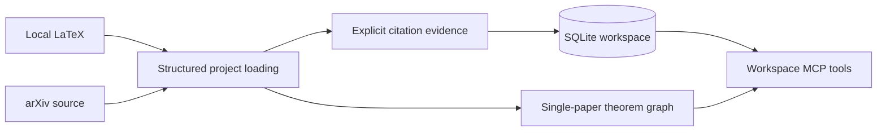

# PaperGraph MCP

[](https://github.com/lotchuazzz-crypto/papergraph-mcp/actions/workflows/ci.yml)
[](https://www.python.org/)
[](LICENSE)
[](https://github.com/lotchuazzz-crypto/papergraph-mcp/releases)

PaperGraph turns local or arXiv LaTeX papers into theorem dependency graphs that AI agents can query through MCP. PaperGraph v0.4.2 hardens first-use analysis with clearer theorem-kind metadata, dependency diagnostics, and guardrails against overreading sparse graphs.

PaperGraph v0.4.0 introduced the persistent, cross-paper SQLite workspace: retain a small literature collection, search theorem text, follow theorem dependencies, and inspect citation evidence without asking an agent to re-read every source paper.

## Why PaperGraph?

Single-paper tools expose theorem-like environments, labels, and `\ref` relationships. A workspace keeps many independently imported papers together. It is deliberately evidence-first: every citation result identifies the source paper, bibliography key, LaTeX command, source file, and resolution status. This is useful for grounded reading and review; it is not semantic theorem matching or a claim that two similarly worded results are equivalent.

## Features

- Load local single-file or multi-file LaTeX projects, or safely prepare arXiv source projects.
- Keep theorem, reference, and citation records in a local SQLite workspace.
- Search theorem titles and bodies across papers, with stable global IDs.
- Traverse direct or recursive theorem dependencies and inspect incoming or outgoing citation evidence, including unresolved citations.
- Preserve the active single-paper graph and active workspace independently.

## Ask your agent to set it up

Give a coding agent this request:

> Clone https://github.com/lotchuazzz-crypto/papergraph-mcp and help me set up PaperGraph for my MCP client. Read the repository's onboarding instructions after cloning.

Compatible agents can follow the repository-local
[`setting-up-papergraph`](.agents/skills/setting-up-papergraph/SKILL.md)
skill. The agent should show you a reusable PaperGraph prompt, explain why `uv`
is needed, and ask before installing software, changing client configuration, or
restarting the client. You can always use the manual setup below instead.

## Quick Start

Install [uv](https://docs.astral.sh/uv/getting-started/installation/), then verify the GitHub release without cloning the repository:

```powershell
uvx --from git+https://github.com/lotchuazzz-crypto/papergraph-mcp.git@v0.4.2 papergraph-mcp --version
```

The pinned command becomes available after the `v0.4.2` GitHub Release and tag are published. Pinning the tag keeps MCP client installations reproducible.

## MCP Configuration

For an MCP client that accepts JSON-style stdio server configuration, add:

```json
{
  "mcpServers": {
    "papergraph": {
      "command": "uvx",
      "args": ["--from", "git+https://github.com/lotchuazzz-crypto/papergraph-mcp.git@v0.4.2", "papergraph-mcp"]
    }
  }
}
```

Restart the MCP client after changing its configuration. The server uses stdio, so running the command without `--help` or `--version` waits quietly for an MCP client connection.

## Tools

The original single-paper tools remain available: `load_paper`, `load_arxiv_paper`, `list_theorems`, `get_theorem`, `get_dependencies`, and `where_used`. Their signatures are `load_paper(path: str)`, `load_arxiv_paper(arxiv_id: str, main_file: str | None = None, refresh: bool = False)`, `list_theorems(kind: str | None = None)`, `get_theorem(theorem_id: str)`, `get_dependencies(theorem_id: str, recursive: bool = False)`, and `where_used(theorem_id: str)`.

Workspace tools operate on the active database. Call `open_workspace` first: `workspace_add_local_paper`, `workspace_add_arxiv_paper`, `workspace_list_papers`, `workspace_get_paper`, `workspace_search_theorems`, `workspace_get_dependencies`, and `workspace_get_citations` require that active workspace. Their exact MCP signatures and return summaries are:

| Tool signature | Returns |
| --- | --- |
| `open_workspace(path: str) -> dict` | Resolved SQLite path, schema version, and paper/theorem counts. Opens an existing workspace or initializes one. |
| `workspace_add_local_paper(path: str, paper_id: str) -> dict` | Imported paper metadata, theorem/kind counts, citation count, and unresolved-citation count. Re-importing an ID replaces it transactionally. |
| `workspace_add_arxiv_paper(arxiv_id: str, main_file: str | None = None, refresh: bool = False) -> dict` | The same import summary after safe arXiv preparation; paper ID and source version are normalized. |
| `workspace_list_papers() -> list[dict]` | Stored-paper metadata and graph counts, in stable paper-ID order. |
| `workspace_get_paper(paper_id: str) -> dict` | One paper's metadata, theorem/kind counts, resolved incoming/outgoing citation counts, and unresolved count. |
| `workspace_search_theorems(query: str, paper_id: str | None = None, kind: str | None = None, limit: int = 20) -> list[dict]` | Matching global ID, paper/local IDs, kind, title, source file, and bounded content excerpt. Empty queries fail; `limit` is 1–100. |
| `workspace_get_dependencies(global_theorem_id: str, recursive: bool = False) -> list[dict]` | Direct or cycle-safe recursive dependency records for a globally identified theorem. |
| `workspace_get_citations(paper_id: str, direction: str = "outgoing", include_unresolved: bool = True) -> list[dict]` | Explicit incoming or outgoing citation-evidence rows. Direction is `incoming` or `outgoing`; incoming rows are resolved. |

For a compact single-paper check, call `load_arxiv_paper(arxiv_id="math/0307200")`. PaperGraph selects `main.tex`; a representative first response has `"path": "main.tex"`, `"cached": false`, and `"nodes": 7`.

## Three-paper local walkthrough

Clone this repository so the tracked synthetic fixtures are available, then use a temporary database path outside the repository (for example, `$env:TEMP/papergraph-demo.sqlite3` on Windows). In your MCP client, call these tools in order; the only values that vary by checkout are the three absolute fixture paths.

```text
open_workspace(path="C:/Temp/papergraph-demo.sqlite3")
workspace_add_local_paper(path=".../papergraph-mcp/tests/fixtures/workspace/paper_a/main.tex", paper_id="local:paper-a")
workspace_add_local_paper(path=".../papergraph-mcp/tests/fixtures/workspace/paper_b/main.tex", paper_id="local:paper-b")
workspace_add_local_paper(path=".../papergraph-mcp/tests/fixtures/workspace/paper_c/main.tex", paper_id="local:paper-c")
workspace_list_papers()
workspace_search_theorems(query="fixed point", limit=10)
workspace_get_citations(paper_id="local:paper-a", direction="outgoing", include_unresolved=true)
workspace_get_citations(paper_id="local:paper-b", direction="incoming")
```

The three local papers make the cross-paper theorem search reproducible: its result IDs are `local:paper-a::thm:main`, `local:paper-b::thm:main`, and `local:paper-c::thm:main`. `paper_a` contains `\cite{paper-b}` and also deliberately contains `\cite{missing}` and `\cite{absent}`. The outgoing evidence preserves those exact uses, including their command and source file. The `paper-b` row has `cited_arxiv_id` `2401.12346`, `resolution_status` `resolved_candidate`, and `target_paper_id: null`; it does not resolve to `local:paper-b`, so `workspace_get_citations(paper_id="local:paper-b", direction="incoming")` returns an empty list. `missing` instead reports `missing_bib_entry`.

A citation obtains a stored target only when its cited arXiv ID is imported through `workspace_add_arxiv_paper`; importing a local paper with a similar bibliography entry does not create that target. This lets an agent distinguish explicit evidence and unresolved target status from a guessed bibliographic relationship, without relying on live downloads in this walkthrough.

## Architecture



## Safety, privacy, and persistence

PaperGraph only constructs remote downloads from arXiv's fixed e-print endpoint; arbitrary URLs are not accepted. It limits compressed responses to **100 MiB**, expanded content to **500 MiB**, and archives to **10,000** members. Absolute paths, parent traversal, symbolic links, hard links, devices, FIFOs, and other special archive members are rejected.

A workspace is an ordinary local SQLite file. Choose a path you control, prefer a temporary directory for experiments, and do not commit its database, private manuscripts, cache data, credentials, tokens, or unsanitized logs. Back up a workspace only while it is not being written (or use your SQLite backup procedure); copying its database file gives you a portable snapshot of the imported evidence and graph data. Treat local source paths and citation content as potentially sensitive.

## Development

Clone the repository and run:

```powershell
uv sync
uv run pytest -q -p no:cacheprovider
```

The automated suite uses synthetic archives, projects, and bibliographies; it does not depend on the live arXiv service.

## Contributing

Bug reports, focused features, and compatibility fixtures are welcome. Read [Contributing](CONTRIBUTING.md) before opening a pull request.

## Limitations

- There is no PDF fallback; PaperGraph requires LaTeX source.
- It does not perform semantic theorem matching, proof verification, or automatic cited-paper download.
- Citation resolution uses explicit bibliography identifiers and evidence; it does not infer a paper from similar titles, authors, or theorem wording.
- Unusual project layouts may require an explicit `main_file`; the parser is not a complete TeX engine.

## License

PaperGraph is available under the [MIT License](LICENSE).
